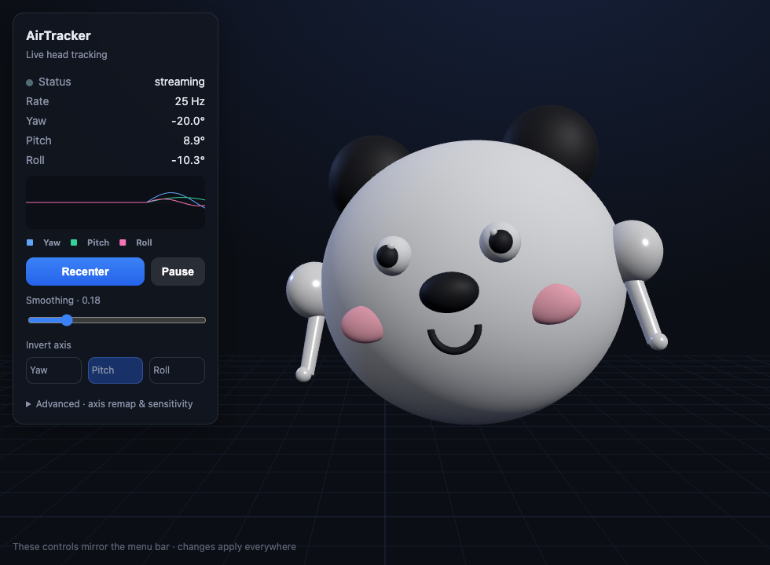

# AirTracker

Use your AirPods as a head tracker for games, natively on macOS.

AirTracker is a small menu-bar app that reads the head-orientation sensors built into
your AirPods (through Apple's `CMHeadphoneMotionManager`) and streams that motion as the
**OpenTrack UDP protocol**. Through [OpenTrack](https://github.com/opentrack/opentrack) it
can drive the in-game camera in any title that supports the TrackIR or FreeTrack
protocols — flight simulators, racing sims, truck sims, and more.

It is the AirPods counterpart to
[sony-head-tracker](https://github.com/NicholasSlattery/sony-head-tracker): it reads the
sensors directly on your Mac (no phone involved) and matches its output protocol.



*The built-in web viewer: a 3D head that mirrors your movement in real time, with a live
orientation graph and every calibration control.*

## Requirements — please read this first

This is not for everyone. Because of how Apple exposes the AirPods sensors, the setup is
specific. Check that it matches yours before downloading.

**You need, without exception:**

- A **Mac running macOS 14 or later**. AirTracker itself only runs on macOS. This is not a
  choice — only macOS provides an API (`CMHeadphoneMotionManager`) to read AirPods motion.
  Windows and Linux have no way to read the sensors inside AirPods at all, which is exactly
  why the Sony project cannot support AirPods on Windows.
- **AirPods that support spatial-audio head tracking**: AirPods 4, AirPods 3, AirPods Pro
  (1st or 2nd gen), AirPods Max, or Beats Fit Pro.

**And then, to actually play a game, one of these two setups:**

1. **Mac + a Windows gaming PC on the same network (the common case).** AirTracker runs on
   the Mac and sends the tracking data over your local network to OpenTrack running on the
   Windows PC, which emulates TrackIR/FreeTrack for the hundreds of Windows games that
   support them (MSFS, DCS, iRacing, Euro Truck Simulator 2, …). You wear the AirPods, the
   Mac reads them, the PC runs the game.

2. **A single Mac, for the smaller set of Mac games that support head tracking.**
   AirTracker and OpenTrack both run on the Mac. This works for macOS titles that read
   OpenTrack/TrackIR input — most notably **X-Plane 11/12** (via a head-tracking plugin).
   Be aware that several big simulators (Microsoft Flight Simulator, DCS) are Windows-only,
   so this single-machine path covers fewer games.

In short: if you own a Mac and either game on a Windows PC on the same network, or play an
OpenTrack-compatible sim on the Mac itself, this is for you. If you have no Mac, or your
game supports neither TrackIR nor FreeTrack, this tool cannot help — and that is a hard
limitation of the platforms, not something the app can work around.

## How it works

```
[ AirPods ] --motion--> [ AirTracker on the Mac ] --UDP--> [ OpenTrack ] --TrackIR/FreeTrack--> [ Game ]
                                                    |
                        localhost (same Mac)  <-----+----->  LAN IP (Windows PC)
```

AirTracker reads the AirPods orientation (~25 Hz), recenters and smooths it, applies your
axis calibration, and emits the OpenTrack UDP packet. OpenTrack is the piece that talks to
games; AirTracker just feeds it. Whether OpenTrack runs on the same Mac or on a Windows PC
is a setting (the target host) in AirTracker.

## Features

- Reads AirPods orientation directly on macOS (~25 Hz); no drivers, no phone.
- OpenTrack UDP output (port 4242), byte-for-byte compatible with sony-head-tracker.
- JSON UDP stream (port 4243) with full sony v2 parity (quaternion, Euler, gyroscope,
  accelerometer, `angularVelocity`, `resetCounter`).
- Built-in web viewer with a live 3D head, an orientation graph, and every control.
- Recenter and pause from the menu, the web viewer, or global hotkeys (Ctrl+Alt+C / Ctrl+Alt+P).
- Full axis calibration: per-axis source remap, inversion, and sensitivity scale.
- Response shaping: deadzone (ignore tiny motion around center) and an expo curve that
  softens small movements without limiting the range.
- Yaw drift compensation: optionally pull yaw back to center at a slow, adjustable rate to
  absorb the sensor drift AirPods accumulate over long sessions.
- Auto-recenter when the AirPods reconnect, so tracking never resumes from a stale reference.
- Streams to any target host — OpenTrack on this Mac, or a Windows PC on your LAN.
- Command-line mode: `probe`, `bridge`, `dump`, `diagnostics` for headless or scripted use.
- Config import/export, diagnostics export, launch-at-login, automatic reconnect.

## Install

Download the latest `AirTracker-vX.Y.Z-macos-universal.zip` from the
[Releases page](https://github.com/crippler95/airtracker/releases), unzip it, and move
`AirTracker.app` to Applications. It is an ad-hoc-signed universal build (Intel and Apple
Silicon), so the first time you open it, **right-click the app and choose Open** to get
past Gatekeeper.

Or build from source (Xcode / Swift 6, macOS 14+):

```bash
git clone https://github.com/crippler95/airtracker.git
cd airtracker
make run
```

`make run` builds the app, assembles `AirTracker.app`, ad-hoc codesigns it, and launches
it. A signed `.app` is required so macOS shows the **Motion & Fitness** permission prompt;
running the bare binary will not trigger it.

On first launch, put your AirPods in and grant the Motion & Fitness permission.

## Setup with OpenTrack

1. Install [OpenTrack](https://github.com/opentrack/opentrack) on the machine that runs the
   game (your Windows PC, or your Mac for setup 2 above).
2. In OpenTrack, set **Input** to **UDP over network**, port **4242**, and press **Start**.
3. In AirTracker's menu, set the **OpenTrack target**: `127.0.0.1` if OpenTrack is on this
   same Mac, or your PC's LAN IP address if OpenTrack is on your Windows PC.
4. Put on your AirPods, look straight ahead, and press **Recenter** (Ctrl+Alt+C).
5. In OpenTrack, choose your **Output** (for example *freetrack 2.0 / TrackIR*) and launch
   the game.

Turning your head left increases yaw; looking up increases pitch; tilting right increases
roll. If any axis feels wrong or swapped, correct it live with the **Invert**, **Source**,
and **Scale** controls in the menu's Advanced section or in the web viewer.

## Test it without a game

Open the built-in viewer, a 3D head that mirrors your movement with a live graph:

```
http://localhost:4244
```

Or inspect the raw streams:

```bash
make listen-4242   # OpenTrack packets: x, y, z, yaw, pitch, roll
make listen-json   # the JSON stream on 4243
```

## Command line

The same binary acts as a CLI when given a subcommand:

```bash
AirTracker probe          # check hardware and permission (exit code 0 = ready)
AirTracker bridge         # stream headlessly, no GUI; --host, --port, --smoothing, --seconds
AirTracker dump           # print raw motion samples
AirTracker diagnostics    # print a redacted diagnostics bundle (JSON)
```

## Troubleshooting

- **No data / 0 Hz.** AirPods only report motion while they are the active audio output.
  Play any audio on the Mac, and disable automatic device switching so they do not hop to
  your iPhone.
- **No permission prompt.** Open System Settings, Privacy & Security, Motion & Fitness, and
  enable AirTracker; run `make reset-tcc` and relaunch if needed. Ad-hoc signatures change
  identity on each rebuild, so a rebuild may require granting the permission again.
- **Cannot reach a PC on the LAN.** Allow Local Network access under Privacy & Security,
  make sure both machines are on the same network, and check that no firewall blocks UDP
  4242.

See [`docs/MACOS.md`](docs/MACOS.md) for a fuller guide and
[`docs/PROTOCOL.md`](docs/PROTOCOL.md) for the exact wire format.

## Project layout

The platform-independent core (`AirTrackerCore`: quaternion math, the orientation pipeline,
UDP/WebSocket/HTTP servers, and the CLI) is unit-tested and shared by both the menu-bar app
and the command line. See [`CONTRIBUTING.md`](CONTRIBUTING.md).

## License

MIT — see [LICENSE](LICENSE). Bundles [Three.js](https://threejs.org) (MIT).

Not affiliated with Apple. AirPods and TrackIR are trademarks of their respective owners.
